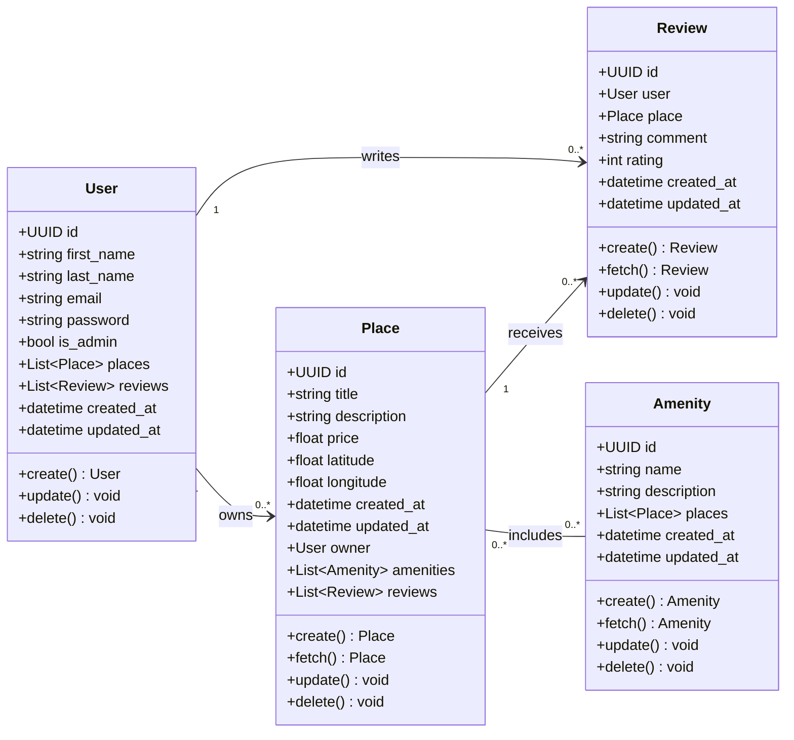

```mermaid
classDiagram
direction LR

class User {
    +UUID id
    +string first_name
    +string last_name
    +string email
    +string password
    +bool is_admin
    +List~Place~ places
    +List~Review~ reviews
    +datetime created_at
    +datetime updated_at

    +create() User
    +update() void
    +delete() void
}

class Place {
    +UUID id
    +string title
    +string description
    +float price
    +float latitude
    +float longitude
    +datetime created_at
    +datetime updated_at
    +User owner
    +List~Amenity~ amenities
    +List~Review~ reviews

    +create() Place
    +fetch() Place
    +update() void
    +delete() void
}

class Amenity {
    +UUID id
    +string name
    +string description
    +List~Place~ places
    +datetime created_at
    +datetime updated_at

    +create() Amenity
    +fetch() Amenity
    +update() void
    +delete() void
}

class Review {
    +UUID id
    +User user
    +Place place
    +string comment
    +int rating
    +datetime created_at
    +datetime updated_at

    +create() Review
    +fetch() Review
    +update() void
    +delete() void
}

User "1" --> "0..*" Place : owns
User "1" --> "0..*" Review : writes
Place "1" --> "0..*" Review : receives
Place "0..*" -- "0..*" Amenity : includes
```
