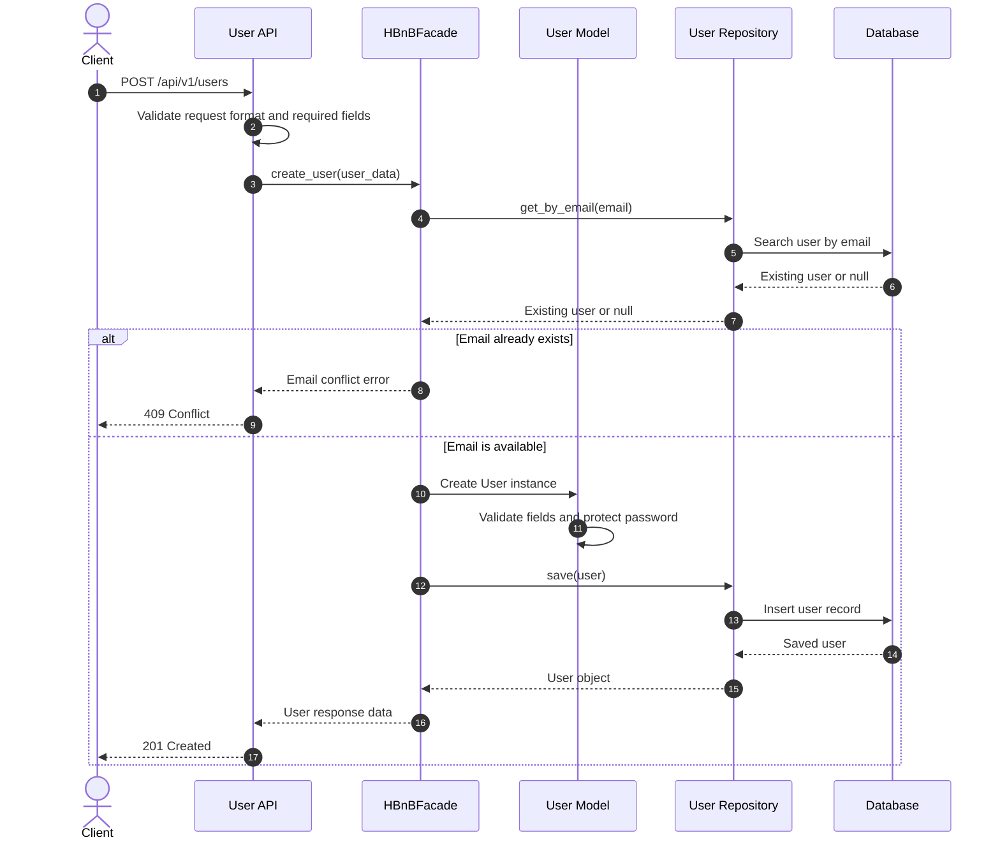
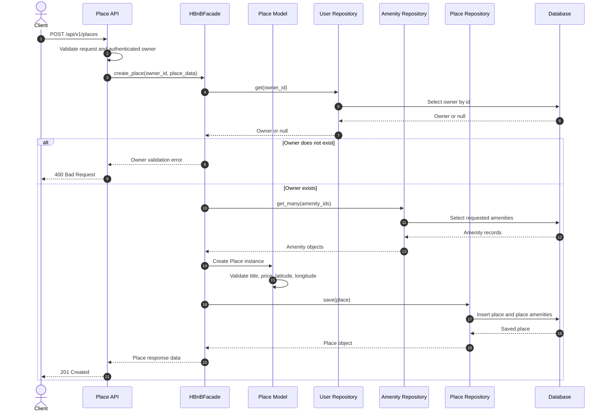
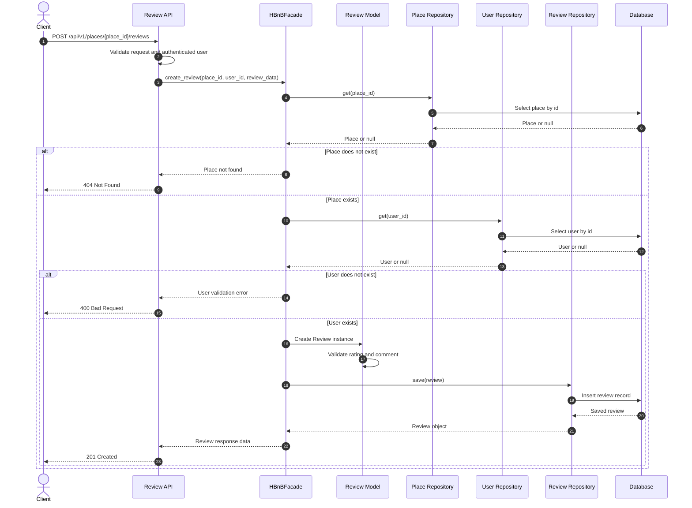
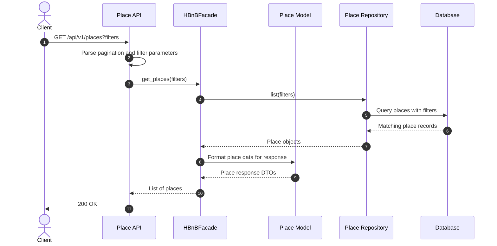

# HBnB Technical Documentation

## 1. Introduction

### Purpose

This document provides the technical design and architecture of the HBnB application. It serves as a blueprint for the implementation phase by documenting the system architecture, business logic, and API interaction flow. It consolidates all UML diagrams produced during the design phase into a single reference that will guide the development of the application.

### Project Overview

HBnB is a web application that allows users to manage places, reviews, and amenities. The project follows a layered architecture that separates the Presentation, Business Logic, and Persistence layers. Communication between the Presentation layer and the Business Logic layer is handled through a Facade, providing a simple and consistent interface for processing application requests.

---

# 2. High-Level Architecture

## High-Level Package Diagram


### Purpose

The High-Level Package Diagram provides an overview of the application's architecture and illustrates how the major layers communicate with each other.

### Architecture Overview

The application is organized into three main layers:

### Presentation Layer

Responsible for:

- Receiving HTTP requests.
- Validating incoming data.
- Returning HTTP responses.

### Business Logic Layer

Responsible for:

- Processing business rules.
- Managing application entities.
- Coordinating operations through the Facade.

### Persistence Layer

Responsible for:

- Storing application data.
- Retrieving data from storage.
- Managing CRUD operations.

### Design Decisions

- A layered architecture was selected to improve maintainability and separation of concerns.
- The Facade simplifies communication between the API and the Business Logic layer.
- The Persistence layer is isolated, allowing storage implementations to change without affecting higher layers.

---

# 3. Business Logic Layer

## Detailed Class Diagram


### Purpose

The Business Logic class diagram defines the application's core entities, their responsibilities, and their relationships.

### Main Classes

#### User

Represents a registered user of the application.

Responsibilities:

- Store user information.
- Authenticate users.
- Distinguish administrators from regular users using the `is_admin` attribute.

---

#### Place

Represents a property listed in the application.

Responsibilities:

- Store place information.
- Reference its owner through the `owner` attribute.
- Manage associated amenities.
- Receive user reviews.

---

#### Review

Represents feedback submitted by users for a place.

Responsibilities:

- Store ratings.
- Store comments.
- Associate users with places.

---

#### Amenity

Represents facilities available for a place.

Examples include:

- Wi-Fi
- Parking
- Swimming Pool

### Relationships

- A Place references a User through the `owner` attribute.
- A User can create Reviews.
- A Review belongs to one User and one Place.
- A Place can contain multiple Reviews.
- A Place can contain multiple Amenities.

### Design Decisions

- Each class is responsible for managing its own data and behavior.
- Ownership is maintained through the `owner` attribute of the Place class.
- User permissions are determined by the `is_admin` attribute.
- Relationships between entities reflect the application's business rules while maintaining clear separation of responsibilities.

---

# 4. API Interaction Flow

This section describes the interactions between the client, Presentation layer, Business Logic layer, and Persistence layer during common API operations.

---

## 4.1 Create User




### Purpose

Illustrates how a new user account is created.

### Interaction Flow

1. The client sends a POST request to create a user.
2. The API validates the request.
3. The request is forwarded to the Facade.
4. The Facade creates the User object.
5. The Persistence layer stores the new user.
6. A success response is returned to the client.

---

## 4.2 Create Place




### Purpose

Illustrates how a new place is created.

### Interaction Flow

1. The client submits the place information.
2. The API validates the request.
3. The request is forwarded to the Facade.
4. The Facade creates the Place object.
5. The owner is associated with the Place.
6. The Persistence layer stores the Place.
7. A success response is returned.

---

## 4.3 Create Review




### Purpose

Illustrates how a user submits a review for a place.

### Interaction Flow

1. The client sends the review information.
2. The API validates the request.
3. The Facade verifies the User and Place.
4. A Review object is created.
5. The Persistence layer stores the review.
6. The API returns a success response.

---

## 4.4 Retrieve Places




### Purpose

Illustrates how the application retrieves available places.

### Interaction Flow

1. The client sends a GET request.
2. The API forwards the request to the Facade.
3. The Facade requests the data from the Persistence layer.
4. The Persistence layer retrieves the places.
5. The data is returned through the Facade.
6. The API returns the list of places to the client.

---

# 5. Overall Design

The HBnB application follows a layered architecture that clearly separates presentation, business logic, and persistence responsibilities. This separation improves maintainability, scalability, and testability.

The Facade acts as the single entry point to the Business Logic layer, simplifying communication between the API and the application's core logic. The Business Logic layer contains the entities and rules that govern application behavior, while the Persistence layer is responsible for storing and retrieving data.

The UML diagrams included in this document describe both the static structure of the application and the runtime interactions between its components. Together, they provide a complete blueprint for implementing the HBnB project.

---

# 6. Conclusion

This document combines the architectural package diagram, business logic class diagram, and API sequence diagrams into a single technical reference. It provides developers with a clear understanding of the system's structure, responsibilities, and interactions, ensuring consistency throughout the implementation phase.

---

# Appendix

## Diagram References

| Diagram | Replace With |
|----------|--------------|
| High-Level Package Diagram | `https://github.com/CyberSpace0/holbertonschool-hbnb/blob/main/part1/package-diagram.png` |
| Business Logic Class Diagram | `https://github.com/CyberSpace0/holbertonschool-hbnb/blob/a2cc68653150e0b562fc0590c0c22c54485a3528/part1/Detaild_Class_Diagaram.png` |
| Create User Sequence Diagram | `https://github.com/CyberSpace0/holbertonschool-hbnb/blob/main/part1/sequence-diagrams.md` |
| Create Place Sequence Diagram | `https://github.com/CyberSpace0/holbertonschool-hbnb/blob/main/part1/sequence-diagrams.md` |
| Create Review Sequence Diagram | `https://github.com/CyberSpace0/holbertonschool-hbnb/blob/main/part1/sequence-diagrams.md` |
| Retrieve Places Sequence Diagram | `https://github.com/CyberSpace0/holbertonschool-hbnb/blob/main/part1/sequence-diagrams.md` |
```
