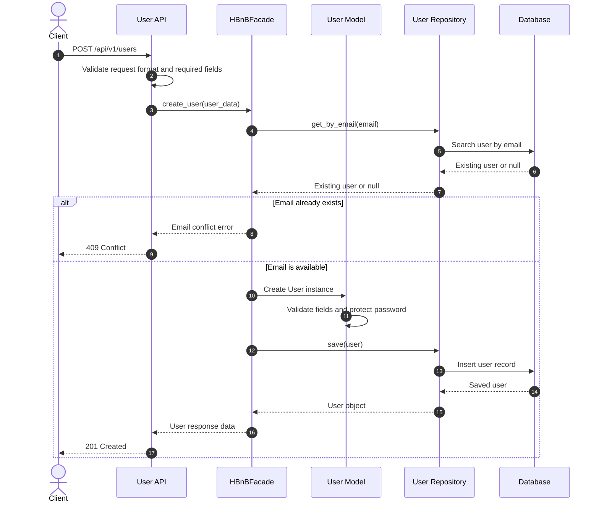
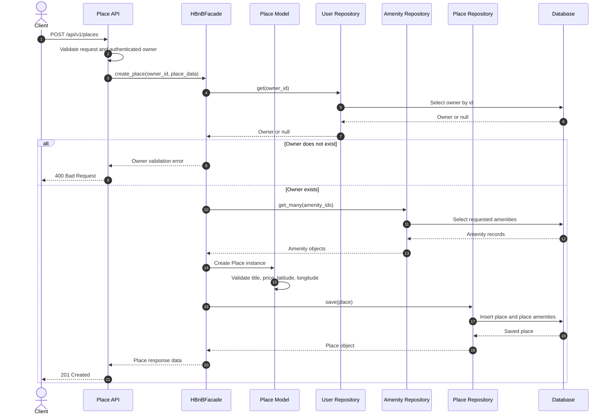
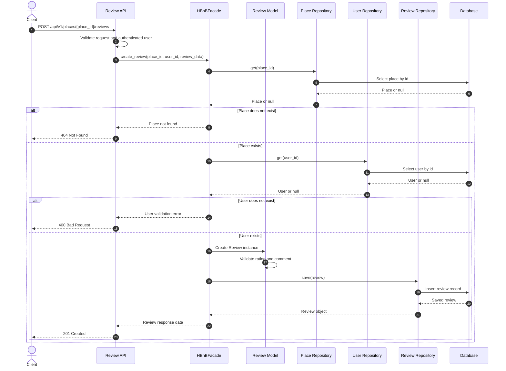
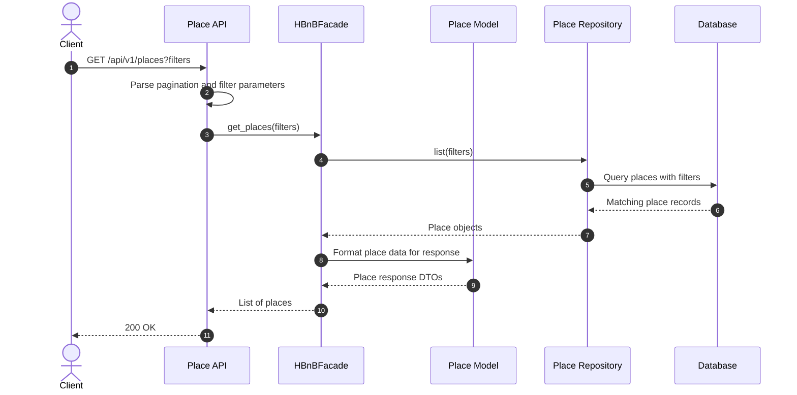

# Sequence Diagrams for API Calls

This document covers Task 2 of the HBnB technical documentation. The diagrams
show how the main API calls move through the Presentation Layer, Facade,
Business Logic Layer, Persistence Layer, and Database.

## Common Participants

- Client: the user or application sending the HTTP request.
- API: the Presentation Layer endpoint that receives and returns HTTP data.
- HBnBFacade: the facade that exposes a simple interface to the API layer.
- Business Logic: the models and validation rules for HBnB entities.
- Repository: the Persistence Layer abstraction used to store and retrieve data.
- Database: the final storage system.

## 1. User Registration

### Explanation

The client sends the registration data to the User API. The API checks that the
request is correctly formatted, then forwards the data to the `HBnBFacade`. The
facade checks that the email is not already used, creates a `User` object through
the Business Logic Layer, and stores it through the repository. If the operation
succeeds, the API returns a `201 Created` response.

## 2. Place Creation

### Explanation

The client sends the place details to the Place API. The API validates the
request and passes the data to the facade. The facade confirms that the owner
exists, loads the selected amenities, creates a `Place` object, validates the
business rules, and asks the repository to save the place. The API returns the
created place when storage succeeds.

## 3. Review Submission

### Explanation

The client submits a review for a specific place. The API validates the request
and sends the place id, user id, and review data to the facade. The facade checks
that the place and user exist, then creates and validates the `Review` object.
The repository stores the review, and the API returns the created review data.

## 4. Fetching a List of Places

### Explanation

The client requests a list of places, optionally using filters such as location,
price, or pagination. The API parses the query parameters and calls the facade.
The facade requests the matching places from the repository, which queries the
database. The results are returned to the API as response data, and the client
receives a `200 OK` response with a list of places.

## Design Notes

- The API layer only handles HTTP input and output.
- The `HBnBFacade` centralizes the main application operations and keeps the API
  from directly depending on repository details.
- The Business Logic Layer is responsible for entity rules such as required
  fields, valid ratings, valid prices, and valid coordinates.
- The Persistence Layer hides the storage implementation behind repositories.
- These diagrams focus on the main success paths while also showing important
  validation failures where they affect the API response.
